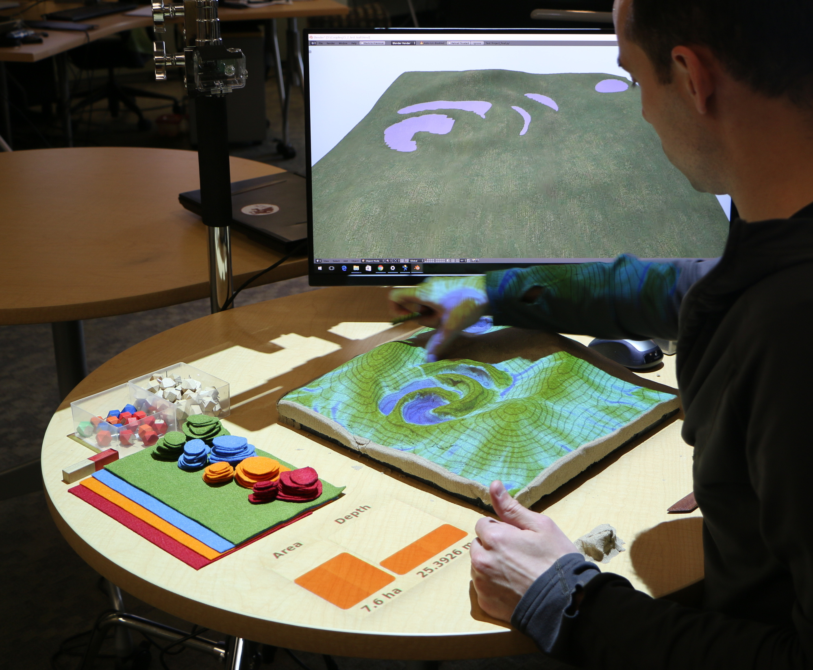
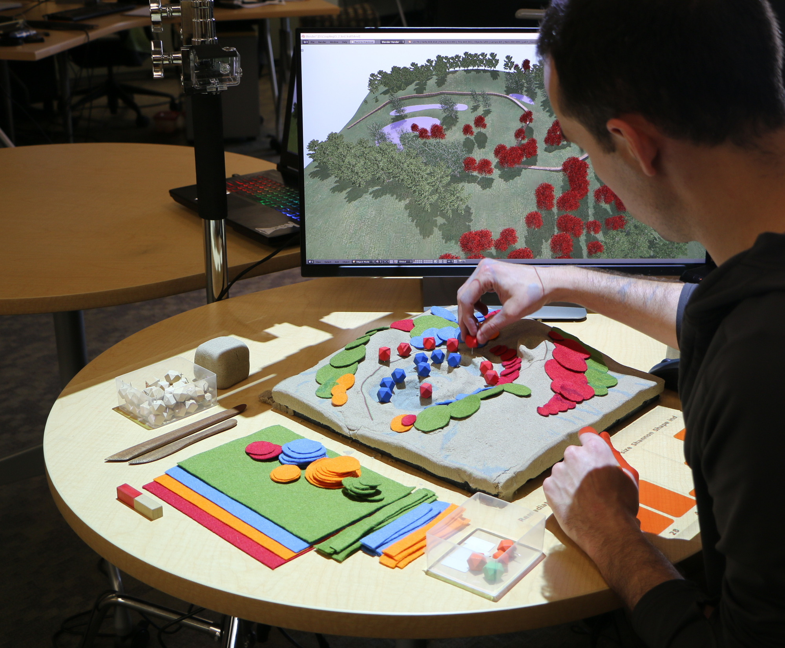
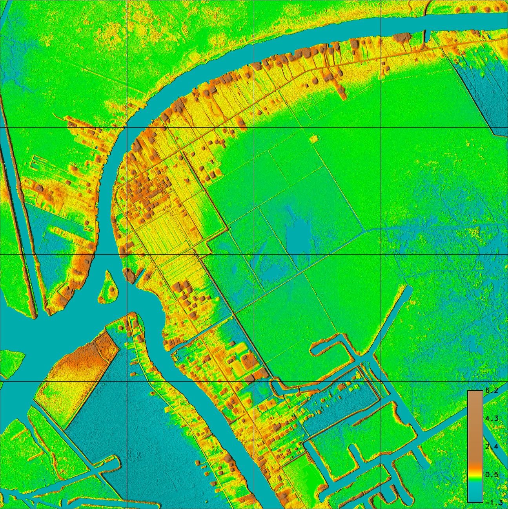

# Participatory Design Studio: Serious Gaming

**Course description**
In this studio you will design and develop serious games
that explore the challenges of coastal change
for the town of Jean Lafitte in Jefferson Parish, Louisiana.
These games will use
[Tangible Landscape](http://tangible-landscape.github.io/) -
a tangible interface for GIS -
to model, simulate, and visualize alternative future scenarios.
The games will address the impact of coastal change -
of storm surge, flooding, erosion, and land-loss -
on Jean Lafitte.
The games will explore how methods for defense or adaptation
such as evacuation, levee construction, elevated buildings, floating buildings,
and bioretention wetlands
perform in simulated storms.
You will  run a serious gaming workshop
for the community in Jean Lafitte
and another for the LSU College of Art and Design.

**Syllabus** | [Spring 2018](syllabus-2018.pdf)

**Assignments** | [Projects](projects.md)

**Software** |
[Installation guide](software.md) |
[GRASS GIS](https://grass.osgeo.org/) |
[Tangible Landscape](https://github.com/tangible-landscape/grass-tangible-landscape) |
[Python](https://www.python.org/) |
[Blender](https://www.blender.org/) |
[Rhino](https://www.rhino3d.com/) |
[RhinoCAM](https://mecsoft.com/rhinocam-software/) |
[Adobe Photoshop](http://www.adobe.com/products/photoshop.html) |
[Adobe Illustrator](http://www.adobe.com/products/illustrator.html) |
[Adobe InDesign](http://www.adobe.com/products/indesign.html)

**Libraries** | [Xfrog](http://xfrog.com/)

**Tutorials** |
[lecture.lsu.edu/](https://lecture.lsu.edu/)

**Readings**
* [Jefferson Parish Hazard Mitigation Plan](http://www.jeffparish.net/modules/showdocument.aspx?documentid=9772)
* [Jean Lafitte Resiliency Plan](https://www.townofjeanlafitte.com/town-plan/)
* [Coastal Protection Restoration Agency (CPRA), Coastal Masterplan 2017](http://coastal.la.gov/our-plan/2017-coastal-master-plan/)
* [Dutch National Coastal Strategy](http://rijksoverheid.minienm.nl/nvk/NationalCoastalStrategy.pdf)
* [World Bank, Cities and Flooding](https://openknowledge.worldbank.org/handle/10986/2241)
* [Acquatecture](https://www.amazon.com/Aquatecture-Buildings-Designed-Live-Water/dp/1859465315/)

**Mapping**
* [Design for Information](https://www.amazon.com/dp/B00MG18BXO/)
* [Else/Where Cartographies](https://www.amazon.com/Else-Where-Cartographies-Networks-Territories/dp/0972969624)
* [Cartographic Grounds](https://www.amazon.com/Cartographic-Grounds-Projecting-Landscape-Imaginary/dp/161689329X/)
* [The Agency of Mapping](http://www.siteations.com/courses/edgeops2014/readings/wk12/corner-agency_of_mapping.pdf)

**Resources**
* [Geospatial data sources](data.md)
* [Precedents](precedents.md)
* [CPRA Masterplan Viewer](https://cims.coastal.louisiana.gov/masterplan/)
* [CPRA Factsheet](https://cims.coastal.louisiana.gov/meta_docs/gis_refs/mp2017_Project_Factsheets/JEF.02N.pdf)
* [Surging Seas: Risk Zone Map](https://ss2.climatecentral.org/)
* [Surging Seas: Fact Sheet](https://riskfinder.climatecentral.org/place/jean-lafitte.la.us)
* [NOAA Digital Coast Sea Level Rise Viewer](https://coast.noaa.gov/digitalcoast/tools/slr)

**Study area** | Jean Lafitte, Jefferson Parish, Louisiana

## Network Drive
Access the class network drive
at `\\desn-knox.lsu.edu\Landscape-Classes\LA-7061` on Windows
or `smb://desn-knox.lsu.edu/Landscape-Classes/LA-7061` on Mac.

## License
Open educational materials licensed CC BY-SA 4.0 by Brendan Harmon :monkey_face:. The license does not apply to logos, fonts, linked material, quotations, or reprinted images by other authors, which may have different licenses. The fonts used in this repository are licensed under the SIL Open Font License by their authors. The syllabus is based on a latex template by Kieran Healy hosted at https://github.com/kjhealy/latex-custom-kjh.
